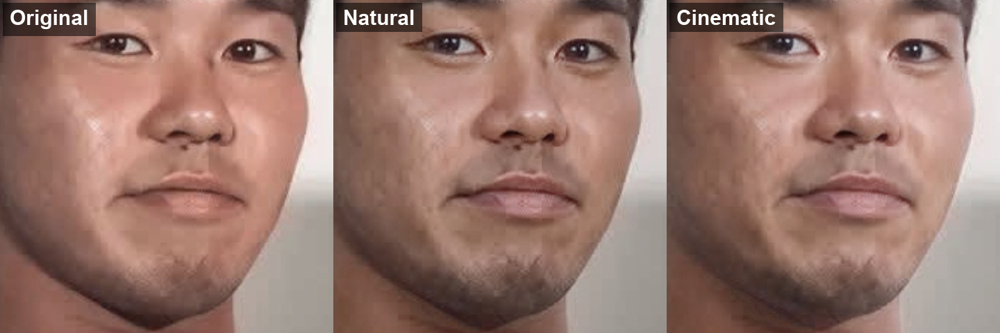
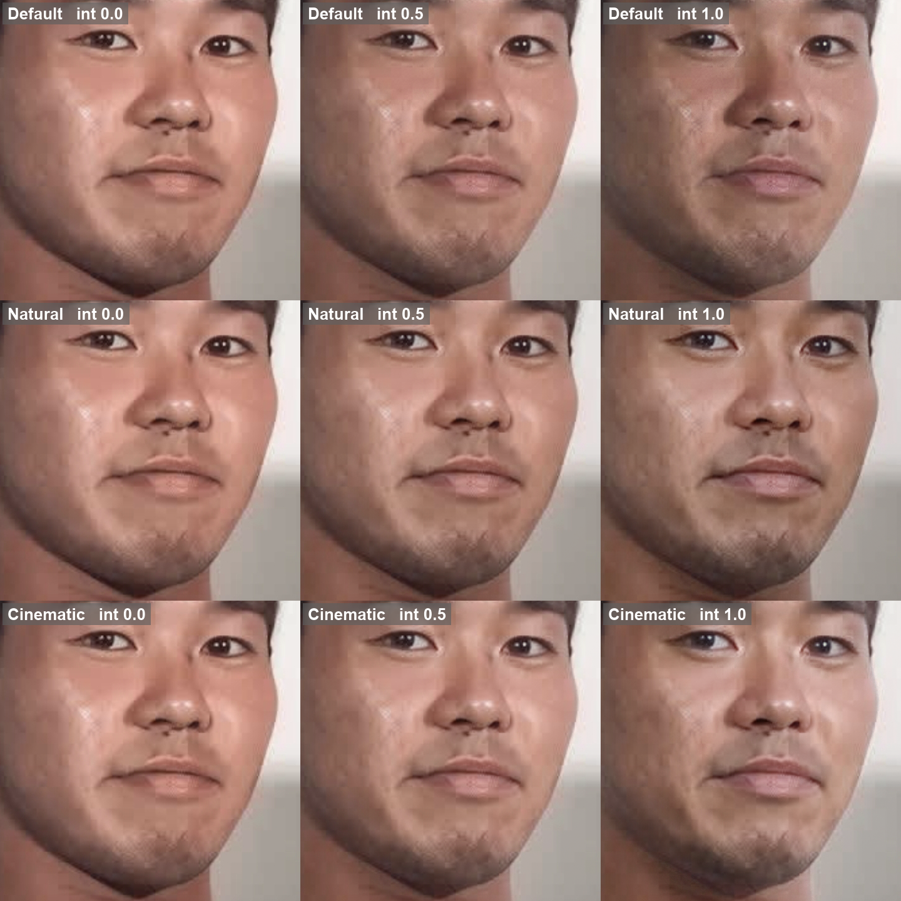
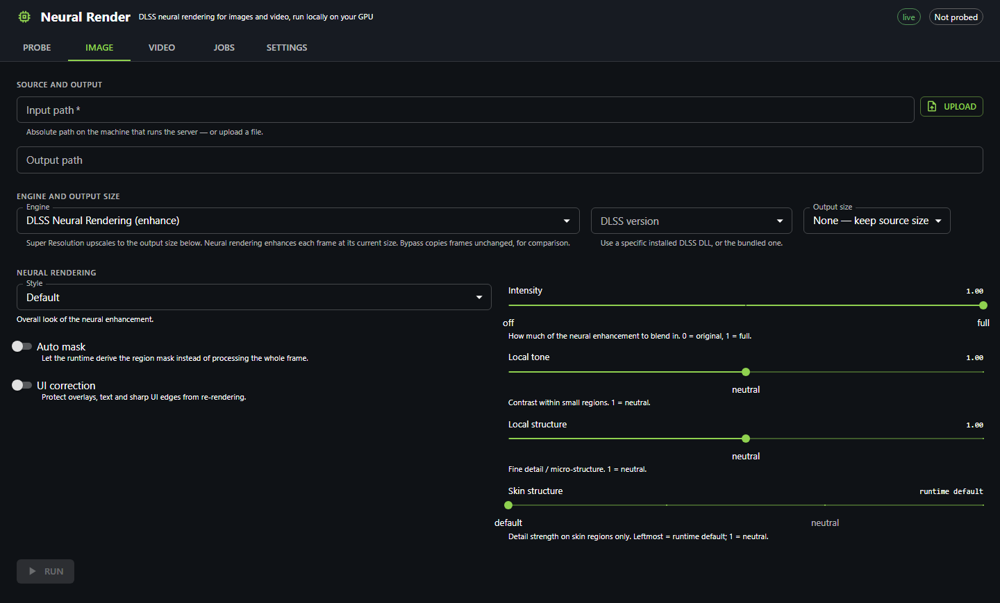
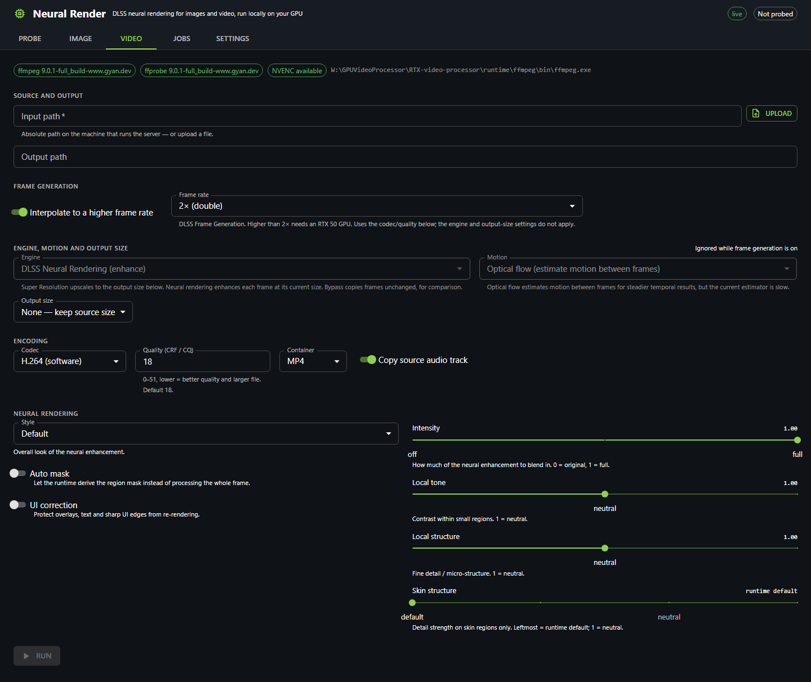
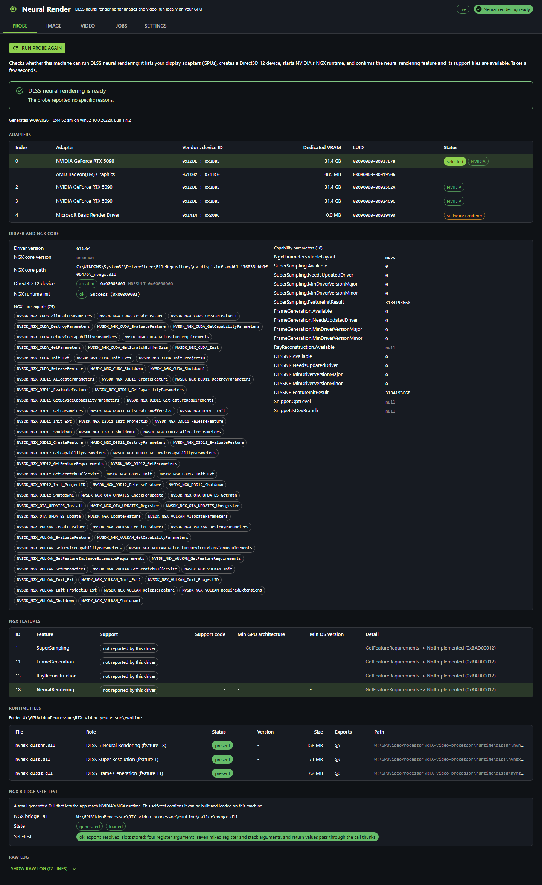

# Neural Render (neural-render-ts)

Apply NVIDIA DLSS to **images and video** on Windows — DLSS Super Resolution (upscaling),
DLSS Frame Generation (higher frame rate) and DLSS Neural Rendering ("DLSS 5", NGX feature 18) —
driven in-process from **Bun + TypeScript** through `bun:ffi` over Direct3D 12 and NVIDIA NGX,
with a **React + Material UI** web front end. DLSS runtimes are version-switchable
(DLSS-Swapper style).



<sub>DLSS Neural Rendering (NGX feature 18) on a real photo — 100% crop: Original vs. the Natural and Cinematic styles.</sub>

The look is tunable — the reference project's controls (model preset, style, intensity and the
strength sliders) are all exposed. This matrix sweeps **style** (rows) against **intensity** (columns)
on the same crop:



<sub>Rows top→bottom: style Default / Natural / Cinematic. Columns left→right: intensity 0.0 / 0.5 /
1.0 (0.0 = original). NR model preset (0–3) is also adjustable, but it is an experimental,
content-dependent hint (per the reference) — Default is recommended and it showed no visible change on
this photo.</sub>

> **Status (2026-09-09).** Runs on the project's RTX 5090. The **web UI** now covers the whole
> pipeline — DLSS Super Resolution upscaling, Neural Rendering (feature 18), Frame Generation, DLSS
> version selection and browser upload — and the **command line** offers the same features for
> scripting. A couple of deep items remain (GPU-resident pipelining, RTX Video SR); the
> [Feature status](#feature-status) table documents honestly what is verified vs. still gated. DLL
> presence alone is not proof a feature works — everything below was exercised on real hardware.

---

## Requirements

- **Windows 11**, an **NVIDIA RTX GPU** (developed and tested on an RTX 5090) with a current driver
  (NGX core `_nvngx.dll` is loaded from the driver; not shipped here).
- **[Bun](https://bun.sh)** (project uses `@types/bun` ^1.4). Native access is via `bun:ffi`.
- **NVIDIA DLSS runtime DLLs** placed under `runtime/` (see [Runtime folder](#runtime-folder)).
  These are **not** redistributed in this repo — you supply your own licensed copies.
- **ffmpeg / ffprobe** for video (bundled under `runtime/ffmpeg/bin`, or on `PATH`, or via
  `FFMPEG_PATH` / `FFPROBE_PATH`).

## Install & run

```bash
bun install
```

Place the required DLSS DLLs under `runtime/` (see below), then start the server (web UI + API):

```bash
bun run dev
```

Open **http://localhost:4080/**. Other scripts:

```bash
bun run typecheck   # tsc --noEmit
bun test            # 110 unit-test cases (pure logic, no GPU needed)
bun run cli <command> [options]   # the DLSS command line (see below)
```

Server environment variables: `PORT` (default **4080**), `NR_RUNTIME_DIR` (default `<repo>/runtime`),
`NR_APPDATA` (default `<repo>/logs`), `NODE_ENV=production` (disables Bun dev bundling).

---

## Command line

`bun run cli <command> [args] [options]` (or `bun run src/cli.ts …`). Run `bun run cli help` for the
overview, or `bun run cli help <command>` / `<command> --help` for details — the CLI is
self-documenting and the in-code `COMMANDS` spec is its source of truth.

| Command | What it does |
| --- | --- |
| `probe` | Inspect GPU / driver / NGX core / `runtime/` and report which DLSS features are ready. |
| `sr <in.png> [out.png]` | **DLSS Super Resolution (feature 1)** — real upscaling of a PNG. The only true upscaler. |
| `nr <in.png> [out.png]` | **DLSS Neural Rendering (feature 18)** — enhance a PNG at the same size (no upscale). |
| `fg <in.mp4> [out.mp4]` | **DLSS Frame Generation (feature 11)** — interpolate a video to a higher frame rate. |
| `versions` | List every installed DLSS runtime DLL per feature (version / source / folder). |
| `forwarder` | (Re)generate the `nvngx.dll` shim NGX requires (auto-built by `sr`/`nr` when missing). |
| `help [command]` | Overview, or per-command help. |

Common options: `--adapter N` (GPU index from `probe`, default auto), `--runtime DIR`
(default `<repo>/runtime`).

Key per-command options (defaults in parentheses):

- **`sr`** — `--factor N` (2; snapped to the nearest fixed DLSS mode: `1.0`=DLAA, `1.3`=Ultra Quality,
  `1.5`=Quality, `1.72`=Balanced, `2.0`=Performance, `3.0`=Ultra Performance), `--preset NAME` (L;
  `A`–`F` are older CNN models, `J`–`O` are transformer models), `--dlss-version VER` (bundled DLL;
  prefix match against `versions`).
- **`nr`** — `--intensity F` (1; a 0–1 blend, 0 = original, 1 = full — values above 1 are clamped),
  `--local-tone F` (1; 0–2, 1 = neutral), `--local-structure F` (1; 0–2, 1 = neutral). (`--preset`
  exists but has no visible effect on the current driver.)
- **`fg`** — `--multiplier N` (2; reliable at 2×, up to the GPU/runtime maximum, e.g. 3×/4× on
  RTX 50), `--codec NAME` (default: GPU NVENC when available, else libx264), `--quality N` (encoder
  quality, CRF for CPU / CQ for NVENC, 0–51, lower = better, 20).

## Web UI

Served by the Bun server at `/` (Bun bundles `web/index.html` directly — no separate build step).
For front-end-only work, `bun run web/mock-server.ts` serves the UI with mock data on
http://127.0.0.1:3080/, and appending `?mock=1` uses an in-browser mock client.

**What the UI does today:** run **image** and **video** jobs with three engines — `sr` (DLSS Super
Resolution upscaling to the chosen output size), `nr` (DLSS Neural Rendering enhancement), and
`bypass` (a plain GPU passthrough copy, for A/B comparison); **DLSS Frame Generation** for video
(2×/3×/4×); **DLSS DLL version selection** per feature; **browser file upload** for the input; a live
job queue with WebSocket progress; a before/after compare view; a hardware/runtime **probe** panel;
and encode settings (codec incl. NVENC, quality, container, audio) for video. Optical-flow motion can
be enabled for video.

**Image tab** — choose an engine (SR upscale / Neural Rendering / bypass), a DLSS version, the output
size and the look controls:



**Video tab** — DLSS Frame Generation, engine/motion, NVENC encoding and the neural-rendering controls:



**Probe tab** — hardware/runtime check (adapters, driver, NGX core, runtime DLLs, caller-shim self-test):



**Notes / honest caveats:**

- The `nr` engine exposes the reference project's controls — **model preset**, **style**, **intensity**
  (0–2), **local tone**, **local structure** and **skin structure** (skin only). Style and the strength
  sliders have a strong, visible effect; **model preset** (0–3) is an experimental, content-dependent
  hint (Default recommended); **global tone** is not applied by the current runtime.
- **DLSS version selection**: the picker defaults to the bundled DLL. Loading an alternate (not
  driver-matched) DLSS DLL can intermittently fail to initialise on newer drivers (a known
  DLSS-Swapper behaviour); the job then reports a clear error and you can retry or pick another.
- Uploaded files are stored server-side under `logs/uploads/`; the browser sends the file to the
  server, which runs entirely on your machine.

## HTTP API

All JSON unless noted. Base is same-origin.

| Method & path | Returns |
| --- | --- |
| `GET /api/probe` | `ProbeReport` (runs the hardware/runtime probe; can take seconds) |
| `GET /api/runtime` | `ProbeReport["runtime"]` |
| `GET /api/tools` | `ToolsReport` (ffmpeg / ffprobe / NVENC availability) |
| `GET /api/catalog` | Runtime DLL catalog (per-feature versions) |
| `GET /api/settings/defaults` | `{ settings, scale, encode }` defaults |
| `GET /api/jobs` · `POST /api/jobs` | list jobs · submit a `JobRequest` → `JobStatus` (201) |
| `GET /api/jobs/:id` · `POST /api/jobs/:id/cancel` | one job · cancel it |
| `GET /api/file?path=<abs>` | raw bytes of a local file (previews; absolute path only) |
| `POST /api/upload` | multipart file upload; returns `{ path }` (a saved absolute path to use as job input) |
| `WS /ws` | server→client `WsEvent` stream (`hello` / `job` / `log`) |

`JobRequest`: `{ kind: "image"|"video", input, output?, engine: "sr"|"nr"|"bypass",
motion: "none"|"flow", settings, scale, encode?, frameGen?: { multiplier }, dllDir? }`. Payload shapes
are defined in [`src/server/api-types.ts`](src/server/api-types.ts).

## Architecture

- **In-process NGX via `bun:ffi`.** `src/native/` binds D3D12/DXGI/PE/Win32; `src/ngx/` drives the
  NGX API. NGX rejects calls whose return address is not inside a module named `nvngx.dll`, so the
  project generates a tiny x64 shim DLL (`runtime/caller/nvngx.dll`, `src/ngx/forwarder.ts`) and
  routes every NGX call through it.
- **Feature 1 (SR)** uses the driver core plus `nvngx_dlss.dll`; **feature 18 (NR)** loads the
  standalone `nvngx_dlssnr.dll` directly with a project-owned parameter object; **feature 11 (Frame
  Generation)** runs out-of-process via NVIDIA's `dlssg-worker.exe` over a small binary protocol.
- **Version switching** = re-init NGX with the chosen DLL on its search path
  (`src/ngx/runtime-catalog.ts`, PE version parsing in `src/native/version-info.ts`).
- **PNG codec** (`src/codec/png.ts`) is hand-written and uses `node:zlib` for (de)compression
  (Bun's built-in zlib is avoided — it produced/consumed corrupt streams).
- **Pipeline** (`src/pipeline/`): ffmpeg decode → per-frame engine → ffmpeg encode; optical-flow
  motion estimation; a job worker; the Bun server (`src/server/`) exposes it over HTTP + WebSocket.

## Runtime folder

`runtime/` is git-ignored (except its `README.md`); you place licensed NVIDIA binaries yourself.

```
runtime/
  caller/nvngx.dll        generated x64 shim (auto-built)
  dlss/nvngx_dlss.dll     DLSS Super Resolution   (feature 1)   [required]
  dlssg/nvngx_dlssg.dll   DLSS Frame Generation   (feature 11)  [required]
  dlssg/dlssg-worker.exe  frame-gen worker process
  dlssnr/nvngx_dlssnr.dll DLSS Neural Rendering   (feature 18)  [required]
  ffmpeg/bin/{ffmpeg,ffprobe}.exe
  host/, rtx_video/       out-of-process host / RTX Video assets (see status)
```

The driver's NGX core `_nvngx.dll` is loaded from the installed driver, never from here.

## Tests

`bun test` runs **110 unit-test cases** across 7 files — all pure logic, **no GPU required**: the
PNG codec, ffmpeg/NVENC/NUT planning math, encoder selection, optical-flow math, the version
catalog, the forwarder shim, and the NGX parameter object. The `tests/diag-*.ts` and `tests/run-*.ts`
scripts are manual GPU harnesses (run individually with `bun run tests/<file>.ts`), not part of the suite.

## Feature status

Verified against the source on 2026-09-09.

| Capability | CLI | Web UI | Notes |
| --- | --- | --- | --- |
| DLSS SR upscaling (feature 1) | ✅ `sr` | ✅ (`sr` engine) | real render/output split in image & video |
| DLSS Neural Rendering (feature 18) | ✅ `nr` (PNG) | ✅ (`nr` engine, image & video) | wired into the pipeline |
| DLSS Frame Generation (feature 11) | ✅ `fg` (incl. 3×/4× on RTX 50) | ✅ (video tab) | no cascade needed — native multi-frame |
| DLSS version enumeration | ✅ `versions` | ✅ (`/api/catalog`) | shown in the version picker |
| DLSS version selection | ✅ SR (`sr --dlss-version`) | ✅ (sr/nr) | alternate DLLs may fail to init on newer drivers |
| Browser file upload | n/a | ✅ | POST /api/upload; stored under logs/uploads/ |
| NR look controls | ✅ (`nr`) | ✅ | style / intensity(0–2) / tone / structure apply strongly; preset exposed (experimental); global tone not applied |
| NVENC (GPU) video encode | ✅ if requested | ✅ if selected | frame-gen GPU-encodes by default |
| GPU optical flow (NVOFA) | ✅ (video/fg motion) | ✅ | hardware flow engine, ~5.7× faster than CPU, auto CPU fallback |
| RTX Video Super Resolution / TrueHDR | ❌ | ❌ | DLLs present but no code path uses them |

### Known limitations / roadmap

- **Performance (GPU under-utilized).** _Done:_ NVENC GPU encoding with CPU fallback (video and
  frame-gen), removed the per-frame pipe flushes, exact-rational frame-gen timing, and **GPU optical
  flow via NVOFA** — the dedicated hardware flow engine, ~5.7× faster and more accurate than the CPU
  block-matcher, with automatic CPU fallback. _Still to do:_ frames still make a synchronous
  CPU→GPU→CPU round trip each frame with no GPU residency or pipelining — planned: keep frames
  GPU-resident and pipeline the GPU.
- **feature 18 in the pipeline — _done_.** The `nr` engine (image and video) now runs DLSS Neural
  Rendering and exposes the reference's controls (model preset, style, intensity, tone/structure).
  Model preset is an experimental, content-dependent hint; global tone is not applied; feature 18 does
  not consume motion vectors.
- **UI feature exposure — _done_.** SR upscaling, frame generation, DLSS version selection and
  browser upload are now in the web UI (see the table above).
- **RTX Video Super Resolution** is not implemented (the DLLs under `runtime/rtx_video` are unused).

## License

This project's own code is provided as-is. NVIDIA DLSS runtime DLLs, ffmpeg, and ReShade are
**not** included and are subject to their own licenses; you must obtain and place them yourself.
