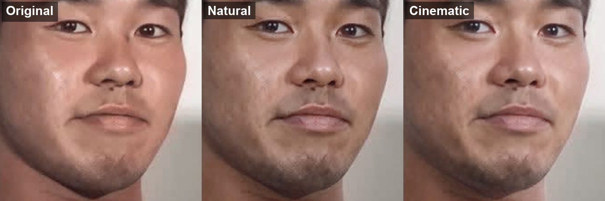
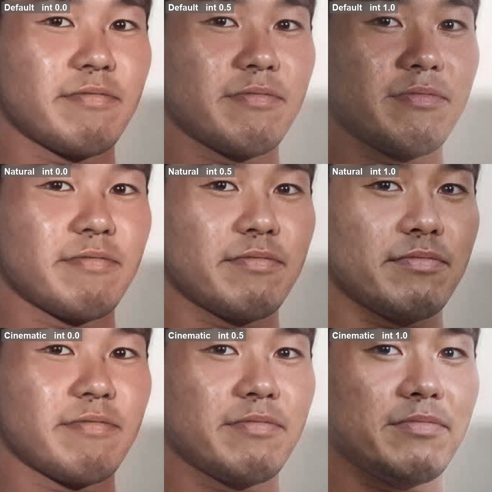

# Neural Render (neural-render-ts)

Apply NVIDIA DLSS to **images and video** on Windows — DLSS Super Resolution (upscaling),
DLSS Frame Generation (higher frame rate) and DLSS Neural Rendering ("DLSS 5", NGX feature 18) —
driven from **Bun + TypeScript** through `bun:ffi` over Direct3D 12 and NVIDIA NGX, with a
**React + Material UI** web front end. The Super Resolution and Neural Rendering runtimes are
version-switchable (DLSS-Swapper style).



<sub>DLSS Neural Rendering (NGX feature 18) on a real photo — 100% crop: Original vs. the Natural and Cinematic styles.</sub>



<sub>Rows top→bottom: style Default / Natural / Cinematic. Columns left→right: intensity 0.0 / 0.5 /
1.0 (0.0 = original).</sub>

> **Status.** Runs on the project's RTX 5090. The **web UI** covers the whole pipeline — SR
> upscaling, Neural Rendering, Frame Generation, DLSS version selection and browser upload. The
> **command line** covers the probe, SR and NR on PNG images, Frame Generation on video and the
> version list; SR and NR on video are web/API only. See [Feature status](#feature-status) below.

---

## Requirements

- **Windows 11**, an **NVIDIA RTX GPU** (developed on an RTX 5090) with a current driver.
- **[Bun](https://bun.sh)** (project uses `@types/bun` ^1.4).
- **NVIDIA DLSS runtime DLLs** placed under `runtime/` (see [Runtime folder](#runtime-folder)).
  These are **not** redistributed — you supply your own licensed copies.
- **ffmpeg / ffprobe** for video: found through `FFMPEG_PATH` / `FFPROBE_PATH`, then `PATH`, then
  `runtime/ffmpeg/bin` (place your own build there).

## Install & run

```bash
bun install
bun run dev              # start server at http://localhost:4080
bun run typecheck        # tsc --noEmit
bun test                 # unit suite (pure logic, no GPU)
bun run cli <command>    # see CLI reference below
```

Server env vars: `PORT` (default **4080**), `NR_HOST` (default **127.0.0.1**, loopback only: the API
has no authentication), `NR_RUNTIME_DIR` (default `<repo>/runtime`; the CLI ignores it and uses
`<repo>/runtime` unless given `--runtime`), `NODE_ENV=production` (turns dev mode off).
`NR_APPDATA` (default `<repo>/logs`) is the folder NGX writes its logs to, for the server and every CLI
command alike; the server stores uploads in its `uploads/` subfolder.

---

## Command line

| Command | What it does |
| --- | --- |
| `probe` | Inspect GPU / driver / NGX core / `runtime/`; exits 0 only when neural rendering is ready. It does not test frame generation. |
| `sr <in.png> [out.png]` | **DLSS Super Resolution (feature 1)** — real PNG upscaling. |
| `nr <in.png> [out.png]` | **DLSS Neural Rendering (feature 18)** — enhance a PNG at the same size. |
| `fg <in.mp4> [out.mp4]` | **DLSS Frame Generation (feature 11)** — interpolate to higher frame rate. |
| `versions` | List every installed DLSS runtime DLL per feature. |
| `forwarder` | (Re)generate the `nvngx.dll` shim NGX requires. |
| `help [command]` | Overview or per-command help. |

### Key options

- **`sr`** — `--factor N` (2, 0.1–8; the output size snaps to the nearest DLSS mode: 1.00 DLAA,
  1.50 MaxQuality, 1.72 Balanced, 2.00 MaxPerf, 3.00 UltraPerformance), `--preset NAME` (L; model preset),
  `--dlss-version VER`
- **`nr`** — `--intensity F` (1, 0–2; no further effect above 1), `--style N` (0; Default / Natural / Cinematic),
  `--local-tone F` (1), `--local-structure F` (1), `--auto-mask`. `--preset`, `--skin-structure` and
  `--ui-correction` are accepted but ignored by `nvngx_dlssnr.dll` 310.8.2.0.
- **`fg`** — `--fps RATE` (a named rate from 23.976 to 480, or an exact `num/den`; default: source fps
  × `--multiplier`), `--multiplier N` (2, whole number 1–16; used when `--fps` is absent),
  `--engine auto|native|cascade` (auto, see below), `--codec NAME` (NVENC when available, else
  libx264), `--quality N` (0–51, lower = better, 20)

Frame generation (`fg` and the Path selector in the web UI): `auto` runs one native DLSS session when
output ÷ source is an exact integer from 2× up to the runtime's MultiFrameCountMax + 1 (measured: 6×
with `nvngx_dlssg.dll` 310.7.129 on an RTX 5090) and, from 3× up, Windows hardware-accelerated GPU
scheduling (HAGS) is on (Settings > System > Display > Graphics > Default graphics settings, then
reboot). Otherwise it chains 2× stages (1 for 2×, 2 for 4×, else 3) and places the nearest frame on each
output instant; when the runtime generates nothing in a native 3×+ session, `auto` re-runs the job that
way. `native` and `cascade` force a path, and `native` fails, writing no output, when the ratio is not an
exact integer in range. A target at or below the source rate generates nothing: the video is only
resampled. The output keeps the source duration and its first audio track (re-encoded to AAC, 192 kb/s).

**Shared options.** `--adapter N` (GPU index from `probe`) applies to `probe`, `sr` and `nr`;
`--runtime DIR` to `probe`, `sr`, `nr`, `fg` and `versions`. Every command except `help` rejects
unknown flags; per-command `--help` lists all options with defaults. Frame generation has no GPU
choice, in the CLI or the web UI: it takes the NVIDIA GPU with CUDA and the most VRAM, and its NVENC
and NVOFA helpers use CUDA device 0, which on a machine with more than one NVIDIA GPU can be another
device.

---

## Web UI

At **http://localhost:4080/** — no separate build step (Bun serves `web/index.html`).
For front-end-only work: `bun run web/mock-server.ts` on port 3080, or append `?mock=1`.

**Image tab** — SR upscale / Neural Rendering / bypass engine, DLSS version, output size, NR look controls,
before/after compare.  
**Video tab** — the same engines on video with optical-flow motion, output size, CPU or NVENC encoding;
or Frame Generation to 23.976–480 fps (auto / native / cascade), which uses only the codec and quality
of the encoding settings, always writes an mp4 and ignores the engine, motion, size and
neural-rendering settings.  
**Jobs tab** — live job list with progress, log tail and cancel.  
**Settings tab** — GPU for image and video jobs (stored by CUDA device UUID; frame generation ignores
it), temporal warm-up (0–64 frames, default 4), stored settings reset.  
**Probe tab** — hardware/runtime check (adapters, CUDA device, optical-flow limits, DLLs, shim).

### Caveats

- A **CUDA device is required**; non-NVIDIA or duplicate DXGI entries are rejected.
- Alternate DLSS DLLs may fail to initialise on newer drivers; the job reports a clear error.
- NR style, intensity (effective to 1), local tone/structure, and auto mask apply; model preset
  and skin structure are shown disabled and UI correction is not offered, because
  `nvngx_dlssnr.dll` 310.8.2.0 ignores them.

## HTTP API

All JSON, same-origin base:

| Method & path | Returns |
| --- | --- |
| `GET /api/probe` | ProbeReport (hardware/runtime probe). It runs in a process of its own, one probe at a time; `500 { error }` if that process fails or runs over 30 s |
| `GET /api/runtime` | Runtime report: the DLLs in the runtime folder, read without a probe |
| `GET /api/tools` | ffmpeg / ffprobe / NVENC availability |
| `GET /api/catalog` | DLL version catalog |
| `GET /api/settings/defaults` | defaults |
| `GET /api/jobs` | list jobs |
| `POST /api/jobs` | submit a job |
| `GET /api/jobs/:id` · `POST /api/jobs/:id/cancel` | status / cancel |
| `GET /api/file?path=<abs>` | raw bytes (previews; absolute path only) |
| `POST /api/upload` | multipart upload → `{ path, name, size }` |
| `WS /ws` | server→client `WsEvent` stream (`hello` / `job` / `log`) |

A job's `state` is `queued`, `running`, `done`, `failed` or `cancelled`. Cancelling a queued job ends it
at once. A running job is asked to stop: it stays `running` with `cancelRequest: "pending"` until it has
stopped, then ends `cancelled` (or `failed`, if a failure came first); a job already finishing its output
completes instead (`done`) and reports `cancelRequest: "too-late"`.

Full request/response shapes in [`src/server/api-types.ts`](src/server/api-types.ts).

---

## Runtime folder

`runtime/` is git-ignored (except its `README.md`). Each file is needed only for its own feature:

```
runtime/
  caller/nvngx.dll        generated x64 shim (built automatically)
  dlss/nvngx_dlss.dll     DLSS Super Resolution   (feature 1)   for sr
  dlssnr/nvngx_dlssnr.dll DLSS Neural Rendering   (feature 18)  for nr; the probe's readiness check
  dlssg/nvngx_dlssg.dll   DLSS Frame Generation   (feature 11)  for fg
  ffmpeg/bin/{ffmpeg,ffprobe}.exe                               for video, if not on PATH
```

The driver's NGX core `_nvngx.dll` is loaded from the installed driver, never copied here.

## Feature status

| Capability | CLI | Web UI |
| --- | --- | --- |
| DLSS SR upscaling (feature 1) | ✅ `sr` | ✅ (`sr`) |
| DLSS Neural Rendering (feature 18) | ✅ `nr` (PNG) | ✅ (`nr`, image & video) |
| DLSS Frame Generation (feature 11) | ✅ `fg` | ✅ (video tab) |
| DLSS version enumeration / selection | ✅ `versions` + `--dlss-version` | ✅ (picker) |
| Browser file upload | — | ✅ (POST /api/upload) |
| NR look controls | ✅ (`nr`) | ✅ |
| NVENC GPU encode | ✅ (`fg` default when available) | ✅ if selected |
| GPU optical flow (NVOFA) | ✅ (fg motion) | ✅ |
| RTX Video Super Resolution / TrueHDR | ❌ | ❌ (not implemented) |

## License

This project's own code is provided as-is. NVIDIA DLSS DLLs and ffmpeg are **not** included —
subject to their own licenses; obtain and place them yourself.
